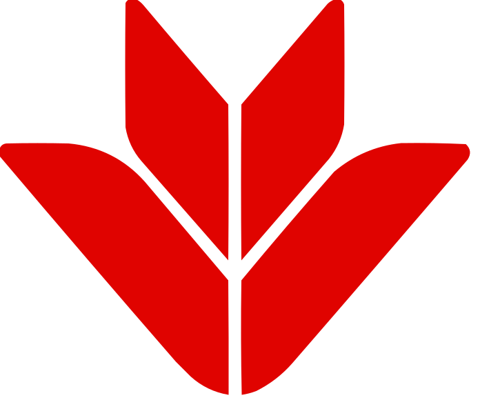

# Hi, I'm Tuan Anh 👋

### (he/him)

I work at [ VPBank](https://www.vpbank.com.vn/ca-nhan) on container orchestration, cloud infrastructure and building a better developer experience.

Previously, I was at  [ Techcombank](https://techcombank.com), and before that was [ Teko](https://teko.vn).

I'm passionated about all things container, k8s and cloud.

My latest interest are currently in

- Software supply chain security.
- [wolfi-dev/os](https://github.com/wolfi-dev/os)
- [awslabs/soci-snapshotter](https://github.com/awslabs/soci-snapshotter)
- etc...

## Projects

- [camaro](https://github.com/tuananh/camaro): Transform XML to JSON using custom XPath template. Focus on performance.
- [hyper-mcp](https://github.com/tuananh/hyper-mcp): A Model Context Protocol (MCP) server with a plugin system powered by WebAssembly & OCI registry.
- [helm-oci-proxy](https://github.com/tuananh/helm-oci-proxy): Turn any legacy Helm repo into OCI Helm repo.
- [wolfi-os](https://github.com/wolfi-dev/os): An OS built for container workload with security in mind. I [contribute to wolfi-dev/os](https://github.com/wolfi-dev/os/commits?author=tuananh) among other things.
- [reader](https://github.com/tuananh/reader):  get a reader mode sharable url for any url - built with cloudflare workers.
- [reader2](https://github.com/tuananh/reader2): Similar to above but using go+wasm.
- [github-followers-watch](https://github.com/tuananh/github-followers-watch): watching changes in your GitHub followers list and commit to GitHub.
- [py-event-ruler](https://github.com/tuananh/py-event-ruler): Test EventBridge pattern locally with Python.

## Talks

- The Road to 0 CVE at [DevSecOps Leadership Forum Singapore](https://www.sonatype.com/devsecops-leadership-forum-singapore-2024) by Sonatype
- Secured Container Images with Wolfi at FOSSASIA 2024 & OpenInfra Asia Summit 2024.
- Defending Software Supply Chain Security in Banking or Any Highly Regulated Environment at Viet OpenInfra 2022
- DevSecOps: Decoding…
- eBPF: A peek into the future of networking security and more at Vietnam Web Summit 2020.
- [Building Docker container: how many ways are too many?](https://www.facebook.com/VietOpenInfra/videos/357437918554003/) at Viet OpenInfra Meetup #24.
- Building Next Generation Websites with Serverless and Micro-frontend Architecture at Vietnam Web Summit 2019.
- Cloud Cost Optimization at Scale at Vietnam Web Summit 2018 and Kubernetes Hanoi Meetup #2 (Mar 2018).

## Blog Posts

- [AWS - The YAML way](https://github.com/tuananh/aws-the-yaml-way): Provision, manage & govern AWS resources with YAML.
- [How small can it be](https://github.com/tuananh/how-small-can-it-be): An experiment to see how small container image for Java application. Answer: it's pretty damn small.
